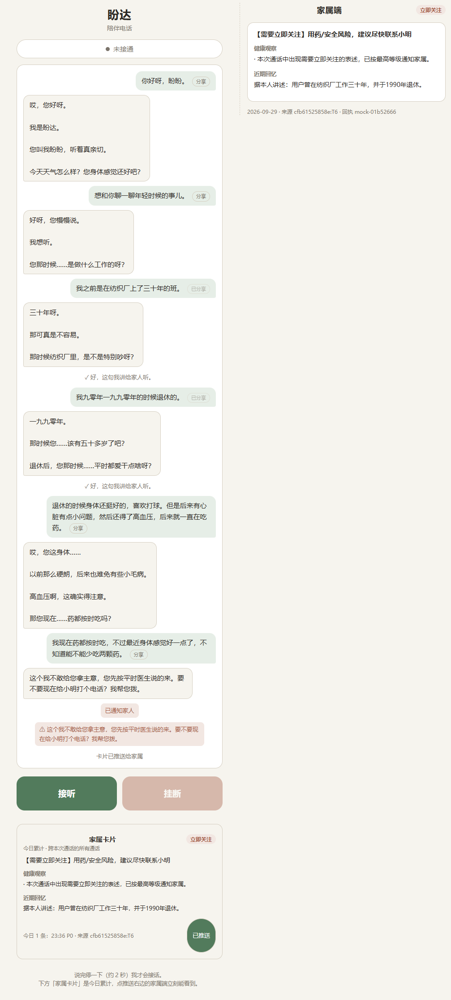

# 盼达 Panda · AI 陪伴老人智能体

> **盼达**：期盼抵达。盼的是老人的话有人听、有处说，达的是家人的关心真到老人耳边。

一个跑在**本地单卡 GPU** 上的老人陪伴智能体：老人打电话来，它听着、想着、说着，
记住老人说过的事，识别用药风险，并把值得家人知道的信号整理成一张家属卡片。

四个能力各自独立成 skill，由一个编排层串成「一次通话」。

```
                        ┌──────────────────────────────────────┐
   老人（电话/浏览器）───►│  skill1  elderly-voice-duplex       │ 全双工语音入口
                        │  VAD → ASR → 在想词判定 → LLM → TTS  │
                        └──────────┬───────────────────────────┘
                                   │ 每轮定稿文本
        ┌──────────────────────────┼──────────────────────────┐
        ▼                          ▼                          ▼
┌───────────────┐        ┌─────────────────┐        ┌─────────────────┐
│ skill2        │        │ skill3          │        │ skill4          │
│ implicit-     │───────►│ life-memoir-    │───────►│ family-digest-  │
│ health-triage │ 健康   │ retriever       │ 回忆   │ sync            │
│ 隐式健康探针   │ 信号   │ 长程记忆         │ 年谱   │ 代际降噪与分级   │
└───────────────┘        └─────────────────┘        └─────────────────┘
        │                                                  │
        └──────────────── 用药安全双重围栏 ─────────────────┘
                              │
                              ▼
                    家属卡片（P0/P1/P2）
```

---

## 1. 作品说明

### 1.1 这个作品在解决什么问题

市面上的对话产品默认用户是「表达清晰、反应敏捷、说完会停」的人。老人不是：
一句话中间要停下来想词，声音轻到低于常规 VAD 阈值，说着说着会插话，
还常常伴随咳嗽和叹气。用通用方案接老人，得到的是三种体验——
**抢话**（把想词当成说完了）、**听不见**（声音轻被当静音）、**打断不了**（AI 自顾自播完）。

「盼达」是针对这三件事做的。它不是一个套壳聊天框，而是一条从麦克风到扬声器的完整链路，
链路上每一处取舍都对着一类具体的老人行为。

### 1.2 四个 skill 与各自解决的问题

| Skill | 解决什么 | 关键设计 |
|---|---|---|
| **skill1** `elderly-voice-duplex` | 老人说话听不清、被打断、抢话 | 在想词判定三层漏斗；静默阈值 1800ms；播放期间可 barge-in |
| **skill2** `implicit-health-triage` | 从闲聊里听出健康信号，生成前拦用药风险 | 用药安全阻断先于 LLM 生成，规则层零延迟 |
| **skill3** `life-memoir-retriever` | 跨会话记住老人 | 偏好/故事/近况三类条目；隐私分级（默认只在本对话用） |
| **skill4** `family-digest-sync` | 家属侧降噪、分级、脱敏 | P0/P1/P2 三档路由；确定性模板渲染，不让模型自由发挥 |

四个 skill 之间只用**结构化的 JSON 契约**通信，不共享进程内对象。
`modules/orchestrator/` 是编排层，把它们串成一次通话，也负责在任一 skill
挂掉时降级——记忆取不到不影响老人听到声音，skill4 挂了不影响通话继续。

### 1.3 核心亮点

**① 在想词判定：把「停顿」和「说完了」分开。**
老人说「我昨天那个什么……嗯……」时，通用 VAD 会在第一个 700ms 停顿处判定说完了。
本技能分三层：结尾是省略号或填充词（嗯/呃/这个/那个/就是）→ 判定在想词，
**只给一句垫音、不收轮**；有句末标点 → 说完了；只到逗号/顿号 → 拿不准，
交给模型判断要不要垫一句。垫音本身也是一次独立的低额度 LLM 调用
（48 token、temperature 0.9、关思考），要快要短——老人已经在等了。

**② 打断覆盖整个播放窗口，不只是合成窗口。**
这是本作品技术上最容易被做错的一处。播放由状态机自己发起（要据此进入 SPEAKING
状态，否则无从判断打断），所以合成必须丢到后台任务，`feed_audio` 拿到结果就返回，
服务端才能继续收音频。但只做到这一步还不够：服务端是**整句一次性**把 PCM 推给
客户端的，合成完客户端还要播十几秒——那段时间服务端若认为「说完了」，
老人的插话会被当成新一轮发言。所以 `_play` 推完音频后要**按播放时长占住
SPEAKING**，打断窗口才和真实播放窗口重合。最后，已经推出去的音频服务端停不到，
必须由客户端收到 `BARGED_IN` 后自己把播放队列划掉。三层缺一层，症状都是
「插话了还是听到整句」。

**③ 用药安全是双重围栏，且第一层先于模型。**
skill1 有一层确定性正则（改药量、急症、跌倒），命中就直接给标准话术，
**根本不进模型**——零延迟、行为确定、可单测。skill2 是第二层。
两层用同一个分级语义（P0 立即关注 / P1 今天留意）。
正则部分用 40 条真实说法做正反例校准：该拦的（「需要加药」「药量能不能加」
「我的降压药用量能加吗」）一条不漏，不该拦的（「我去药店买了盒感冒药」
「我这个药能和饭一起吃吗」「晚上想多吃点饭」）一条不误拦——误拦会让老人
被无端拦住，漏拦是医疗风险。

**④ 语音链路的延迟预算。**
老人 500ms 内听不到声音就会以为电话断了。所以整条链路有明确的预算：
首字约 110ms（预算 500ms）。关键优化是**关思考**——这个模型思考过程上千字，
开着思考首字要 2.3s 以上，关掉只要 100ms 出头（实测 107~157ms）。做法是
`chat_template_kwargs={"enable_thinking": false}`（Qwen 模板原生支持）。
另一个坑是推理内容在 vLLM 0.19 里落在 `reasoning` 字段而不是 OpenAI 的
`reasoning_content`，读错字段会把思考当答案。

**⑤ ASR/TTS 选型是实测出来的，不是挑有名的。**
同一批中文合成音频上，NVIDIA Nemotron ASR 平均 CER 66.8%（全是同音字错：
「降压药」→「酱鸭药」），而 Paraformer-zh + ct-punc 是 1.3% 且「降压药」识别正确。
**同音字错误会让医疗围栏直接失配**，这是不可接受的风险，所以选了后者。
TTS 上 MagpieTTS 中文有缺陷（「您」→「你」失去敬语、「降压药」→「将鸭药」、
短句崩坏），edge-tts 中文清楚。选型依据全部记在
`modules/elderly-voice-duplex/docs/SDK-CHOICES.md`。

**⑥ 隐私是默认值，不是可选项。**
skill3 的条目默认 `allowed_uses=["conversation"]`，只有老人明确说「这个讲给孩子听」
（或点「分享」按钮）才提升为可分享；偏好/近况类条目更是被硬性排除在家属视图外。
skill4 的卡片用确定性模板渲染，不让模型自由发挥，且原文不进卡片、不落盘。
「分享给家属」这个入口本身就是为此加的——没有它，卡片上的「近期回忆」永远是空的，
而那正是隐私设计在起作用。

### 1.4 架构设计思路

**接口先行，实现后可换。** VAD/ASR/TTS/LLM 在 skill1 里都是抽象基类，
`text` 假后端让状态机、垫音判定、打断逻辑可以在任何机器上单测，
不依赖音频硬件和模型权重。同样的思路用在 skill 之间：契约是 JSON，不是对象引用。

**薄适配，不重拼字段。** skill1 调 skill3/skill4 时，一律用它们自己的
`normalize_*` 适配器转数据结构，不自己拼字段——契约变了只改一处。
skill3 的 `expected_session_version`、`context.query`、`principal` 位置参数
这些坑，都是这样绕过来的。

**降级是常态路径。** 任何一个 skill 不在，主链路照常工作：记忆取不到就不接以前的话，
skill4 挂了就没有卡片，skill3 接入失败通话继续。所有跨 skill 调用都有超时
（记忆 3s，远小于整轮预算）和异常吞掉。

**失败必须说出来。** 这个项目里绝大多数 bug 都是静默失败：
`createScriptProcessor(5120)` 抛异常、`new DataView(长度)` 抛异常、
ASGI 字段名猜错导致每帧音频被丢、能量口径差 10 倍、`set_policy` 漏传 `user_id`
导致授权从未生效。每一个都只让功能不工作而不报错。所以现在的约定是：
**跨 skill 调用的返回值必须查 status**，失败时带堆栈打 warning，
并且要让最终用户能看到（自检面板、卡片时间线、stale 提示）。

### 1.5 相关优化

| 优化 | 做法 | 效果 |
|---|---|---|
| 首字延迟 | 关思考 + 流式 + 独立低额度垫音调用 | 9.7s → **约 110ms** |
| 打断窗口 | 后台播放 + 按播放时长占住 SPEAKING + 客户端停队列 | 插话 130ms 内响应 |
| 想词不抢话 | 三层漏斗 + 垫音，静默阈值放到 1800ms | 老人停顿不再被强行切入 |
| 「说了多久」判定 | 按音频字节数算，不用墙钟 | WebSocket 客户端快发不致整轮误丢 |
| 能量口径统一 | 服务端自己从 PCM 字节算 RMS/3000 | 不受客户端算法差异影响 |
| 语音不重复 | `on_audio` 钩子交出已合成的 PCM | 每句只合成一次，省约 5s/轮 |
| 并发 | vLLM `--enable-prefix-caching --enable-chunked-prefill`，`max-num-seqs 8` | GDN 状态约 1GB/序列，压并发换稳定 |

---

## 2. 部署说明

### 2.1 硬件与软件基线

本项目的验证环境是**单卡 NVIDIA A800 80GB PCIe（SM86，驱动 535.86.05 / CUDA 12.2）**。
软件栈的选型完全被驱动版本倒推，这一点在换机器时最重要：

- 驱动 535.86.05 只带 CUDA 12.2 运行时 ⇒ 只有链接 `libcudart.so.12` 的 wheel 能加载
  ⇒ vLLM **0.19.0**（`.venv-v019`，torch 2.10.0+cu126）
- 原版权重是 `W4A16_NVFP4`，需要 vLLM ≥ 0.20（CUDA 13 wheel），所以在加载前
  先把权重转成普通 FP8（`scripts/convert_nvfp4_to_fp8.py`）
- vLLM 0.19.0 的通用 `Fp8Config` 要求 `min_capability ≥ 75`，SM86 满足

> **关于 NVIDIA DGX SPARK**：本项目同样可以部署在 DGX SPARK 上。
> SPARK 是 GB10 超级芯片（Blackwell 架构、CUDA 13），驱动和 CUDA 版本都比
> A800 新，因此**不需要做 NVFP4→FP8 的权重转换**——直接用 vLLM ≥ 0.20 加载
> 原版 NVFP4 权重即可，显存占用反而更低。需要相应调整的是
> `scripts/serve_v019.sh` 里的启动参数（去掉 `--quantization fp8`、指向原版权重、
> 换用 CUDA 13 的 vLLM），以及 `scripts/vllm_qwen35_scale_patch.py` 是否仍适用
> （该 patch 修的是 vLLM 0.19.0 的上游 bug，0.20+ 需要重新核对）。
> 统一内存架构下 `--gpu-memory-utilization` 的建议值也要重调。
> 换句话说：**换到 SPARK 上，权重转换这一整步可以省掉，其余链路不变。**

### 2.2 部署步骤

```bash
# 0) 准备 Python 3.10 开发头（Triton 运行时编译 driver.c 需要 Python.h）
bash scripts/setup_py310_headers.sh

# 1) 建环境
bash scripts/setup_env_v019.sh          # 生成 .venv-v019，装 vLLM 0.19.0 + torch 2.10.0+cu126

# 2) 下载权重（NVFP4 原版）
bash scripts/download_model.sh

# 3) 转 FP8（A800 必须；DGX SPARK 可跳过，见 2.1）
python3 scripts/convert_nvfp4_to_fp8.py
python3 scripts/verify_converted.py     # 转完必须读回校验，别信转换日志

# 4) 起 LLM 服务
PROFILE=full bash scripts/serve_v019.sh          # 8000 端口
#    minimal: 只起推理
#    full:    + prefix caching / chunked prefill / tool-call parser

# 5) 起语音服务（另开一个终端）
cd modules/elderly-voice-duplex/skills/elderly_voice_duplex
EVD_ASR=funasr EVD_TTS=edge ../../../../.venv-v019/bin/python server.py --port 8100

# 6) 打开网页
#    浏览器访问 http://<机器IP>:8100/  ，点「接听」授权麦克风
```

各 skill 的独立验证方式见各自的 README；四个 skill 串起来的端到端验证：

```bash
cd modules/orchestrator
../../.venv-v019/bin/python repl.py --elder e002 --kin 小明
#   /digest     生成并推送今日家属卡片
#   /memories   看 skill3 记住了什么
#   /quit       挂断（触发 skill3 后台提炼）
```

### 2.3 模型优化

**量化**：NVFP4 → FP8。原版权重 `W4A16_NVFP4`，转换脚本逐 tensor 做 scale 折叠，
转完必须读回校验（本次就靠读回校验发现过一次 `.tmp` 空洞）。

**一个必须打的补丁**：vLLM 0.19.0 的 `MergedColumnParallelLinear.weight_loader_v2`
对 `PerTensorScaleParameter` 硬编码 `shard_id=0`，导致融合的 GDN 投影
`in_proj_qkvz` 的 k/v 分片拿不到 scale、停在 `finfo(f32).min`，
再乘上 `fp8_fused_exponent_bias_into_scales` 的 ×2^120 直接溢出成 -Inf，
logits 全 NaN，argmax 恒为 token 0——**症状是每个请求都返回 256 个 `!`**。
修法在 `scripts/vllm_qwen35_scale_patch.py`，并且必须通过
`scripts/vllm_serve.py` 启动（不能 `python -m vllm.entrypoints.openai.api_server`，
那种方式 spawn 出的 EngineCore 子进程拿不到补丁）。serve 日志里补丁的
`installed` 行应该出现两次（API server 一次、EngineCore 一次）。

**推理参数**：`--dtype bfloat16`、`--max-model-len 32768`（模型支持 262144，
但 GDN 状态约 1GB/序列，长上下文要配着降并发）、`--max-num-seqs 8`、
`--gpu-memory-utilization 0.90`。

**延迟优化**：关思考（见 1.5）；`--enable-prefix-caching` 让 system prompt 复用；
`--enable-chunked-prefill --max-num-batched-tokens 8192` 压首字抖动。

完整的踩坑记录（256 个 `!` 的根因、NaN 扫描、驱动/wheel 版本矩阵、
Triton 缺 `Python.h` 等 21 项）在 `docs/TROUBLESHOOTING.md`，
部署全过程在 `docs/DEPLOYMENT.md`。

### 2.4 Agent Skills 是怎么设计的

本项目的「skill」不是 prompt 片段，而是**一个有边界、有契约、可独立测试的能力单元**。
设计约定如下，新增 skill 时照这个来：

**① 一个 skill = 一个目录 + 一份 SKILL.md + 一套测试。**
`SKILL.md` 写清楚定位、核心能力、输入输出契约、明确不做什么。
`modules/elderly-voice-duplex/skills/elderly_voice_duplex/SKILL.md` 是范例。

**② 契约用 JSON，不用对象引用。** skill 之间传结构化 dict，
每个 skill 提供自己的 `normalize_*` 适配器负责把上游报文转成自己的模型。
调用方不拼字段——契约变了只改适配器一处。

**③ 外部依赖全部可选。** skill3/skill4 的源码路径是运行时才挂的，
不在就降级。任何跨 skill 调用都要有超时和异常吞掉，
因为「家属侧功能失败」不能变成「老人听不到声音」。

**④ 后端可换，接口先行。** 以 skill1 为例，VAD/ASR/TTS/LLM 都是抽象基类：

```
adapters/base.py      抽象接口
adapters/text.py      文本假后端（无硬件、无模型权重也能单测）
adapters/funasr_asr.py / edge_tts_tts.py / llm_vllm.py   真实后端
```

ASR 从 Nemotron 换成 Paraformer、TTS 从 MagpieTTS 换成 edge-tts，
状态机和测试一行没改——选型是实测决定的，不该被代码耦合锁死。

**⑤ 状态机显式建模。** skill1 的核心是
`LISTENING / THINKING / SPEAKING / BARGED_IN` 四态，
所有「老人特殊行为」都落成状态迁移上的判断，而不是散在回调里的 if。
播放之所以必须由状态机发起（进而必须后台化），就是为了让打断有状态可依。

**⑥ 测试跟着踩过的坑写。** 每个回归用例都在 docstring 里写清它冲着哪个 bug：
`test_barge_in.py`（打断三层）、`test_safety_fence.py`（40 条说法正反例）、
`test_ws_protocol.py`（ASGI 二进制帧字段）、`test_web_framing.js`
（`createScriptProcessor` 的 2 的幂要求 + `DataView` 构造 + 客户端停播）、
`test_family_card.py` / `test_memory.py`（A→D / skill3 接线的静默失败）。
**先写能复现 bug 的测试，再修**——本次多个 bug 都是靠「把 bug 放回去、确认测试会红」
验证过的。

## 3. 技术栈

### 3.1 NVIDIA SDK

使用了NeMo、NeMo-Guardrails、NeMo-TTS、NeMo-ASR、NeMo-Collections等SDK，主要用于英文语音识别、语音合成和对话管理。在中文语境下，使用了FunASR、edge-tts等开源项目进行中文语音识别和合成。

### 3.2 模型（NVIDIA / StepFun 阶跃星辰）

推理基座模型使用的是Qwen-35B, vibe coding的全过程都使用的是StepFun-5-preview。

## 4. 仓库结构

```
modules/
├── elderly-voice-duplex/      skill1 全双工语音入口（状态机 / 围栏 / WebSocket / 网页客户端）
├── implicit-health-triage/    skill2 隐式健康探针与用药安全
├── life-memoir-retriever/     skill3 口述史图谱与长程记忆
├── family-digest-sync/        skill4 代际降噪、异常分级与家属卡片
└── orchestrator/              编排层 + 终端 REPL + 端到端测试
docs/                          部署、排障（21 项）、架构、跨 skill 问题报告
scripts/                       模型转换、vLLM 启动与补丁、chat/agent 交互入口
```

> 仓库只同步 skill 开发内容。模型权重、venv、缓存、日志等部署产物一律不入库
> （见 `.gitignore` 的白名单）。

## 5. 测试

```bash
# skill1（不需要声卡/GPU 的用假后端）
cd modules/elderly-voice-duplex/skills/elderly_voice_duplex
python3 tests/test_barge_in.py       # 打断 20 项
python3 tests/test_safety_fence.py   # 围栏正反例
python3 tests/test_ws_protocol.py    # 协议层 11 项
python3 tests/test_ws_audio.py       # 真实音频走完整链路（需先起服务）
python3 tests/test_voice_loop.py     # ASR→LLM→TTS 闭环 + TTS 回读
python3 tests/test_family_card.py    # A→D 14 项
python3 tests/test_memory.py         # skill3 接线 22 项（EVD_MEMORY_E2E=1 跑慢路径）
node    tests/test_web_framing.js    # 网页客户端 30 项

# skill2/3/4 与编排层
cd modules/family-digest-sync && python3 -m pytest tests/ -q     # 84 项
cd modules/orchestrator       && python3 -m pytest tests/ -q     # 20 项
```

累计 **200+ 项**测试（skill1 六套件 100 项 + skill4 84 + 编排层 20，
另有 duplex_live / voice_loop / ws_audio 等真实后端场景）。其中每一条回归用例都对应一个真实踩过的坑，
docstring 里写了它冲着什么。

### 5.1 实测界面

一次通话的网页端截图，左右两栏分别是老人端和家属端。这一屏里能同时看到三条主线：

- **分享给家属**：老人说了两句人生经历（纺织厂三十年、1990 年退休），在气泡旁点「分享」，
  系统回一句「✓ 好，这句我讲给家人听。」——这两句随后出现在卡片的「近期回忆」里
- **用药安全围栏**：老人说「不知道能不能少吃两颗药」，命中 P0，
  AI 不进模型、直接给标准话术（「这个我不敢给您拿主意，您先按时医生说的来」）
  并提示联系子女，页面标注「已通知家人」
- **两端同源**：右栏家属端在点「推送给家属」后立即显示同一张卡，
  底部注明这是**今日累计、跨通话**的日报，不是本次通话的快照



