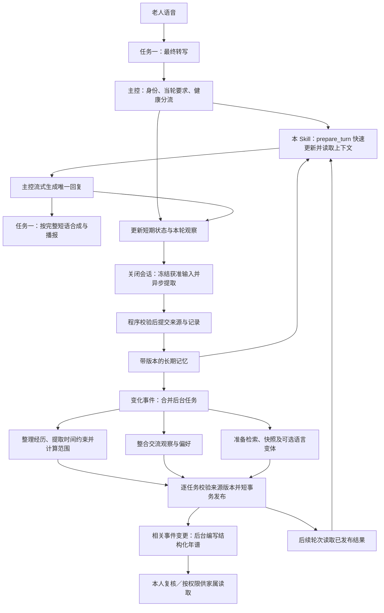

# Skill 设计评审稿 v0.5

负责人：卢易锋｜日期：2026-09-26｜状态：**v0.5 设计档案。已获授权并交付 0.1.0 联调包，以下保留完整目标；实际实现范围以[运行说明](../../modules/life-memoir-retriever/README.md)为准。**

本稿记录总体方案，设计期契约见 [API.md](API.md)，示例见 [api-examples.json](api-examples.json)。接入时使用[正式 OpenAPI](../../modules/life-memoir-retriever/schemas/openapi.json)，不要把档案中的拟定字段直接当作已实现接口。

**v0.2 增补反应速度要求：**会话预读、合并一次调用、检索等待预算、流式回复及后台资源控制。依据与比较见 [GitHub 方案调研](LATENCY-RESEARCH.md)；性能数字是待验证目标，尚无实测结果。

**v0.3 增补语言适配要求：**区分用户语言、处理语言和英文字段；原语言实时路径优先验证，英文后台／本地翻译作为候选适配。详见 [语言与 NVIDIA 兼容设计](LANGUAGE-DESIGN.md)。团队截图不是官方赛事规则，翻译方案也尚未被选定。

**v0.4 增补后台并行分析：**依据卢易锋的补充，将分析从“只在会后总结一次”扩展为由数据变化驱动的后台任务。已经获准保存的历史可在下一次聊天前、聊天期间或两次聊天之间整理；实时回复使用已完成的结果。以下并发与调度规则是本项目设计，尚未运行验证。

**v0.5 增补两项核心能力：**将研究转为六类[情境子能力](SCENARIO-SUBSKILLS.md)，适应担忧、低落、记忆／理解困难等实际交流需要；通过后台时间推理生成[结构化人生年谱](CHRONICLE-DESIGN.md)，保留年份范围、关系、细节、原话依据与 AI 整理文字。它们仍是待审核设计，不诊断用户，也不要求逐年问询。

## 1. 建议采用的整体方案

**一个主 Skill + 按情境加载的子能力 + 一个记忆服务 + 长短期分层 + 可推理、可复核的个人年谱。**

- Skill 暂定沿用上游已引用的名称 `life-memoir-retriever`，避免另起名称增加接入成本。其实际能力覆盖记录、检索、总结与偏好更新。
- 同一个本地数据库分别保存人生经历／细节、交流观察／偏好；两类记录拥有各自的来源、时效和用途限制。
- 短期层管理当前话题、当天状态与近期事项，长期层负责跨会话保留；长期记忆可按需调入短期上下文。
- 核心逻辑只实现一份，对外提供 Python 调用、JSON CLI 和 HTTP API；三者使用同一请求／响应模型。
- 模型只负责提出结构化候选结果；身份、权限、写入、更正、删除、有效期和去重由程序执行。
- 子能力提供具体的问法、切换与退出条件，不给老人分互斥的疾病类型。主控仍是唯一回复出口，实时路径不新增分类模型调用。
- 年谱由故事记录派生：模型提取时间线索，程序计算范围并检查冲突，后台再生成有来源的叙事；时间不明也可以保留故事。

建议首版技术选择为 Python 3.11、SQLite 与进程内会话缓冲，HTTP 层采用 FastAPI。它们是本项目实现选择，不是竞赛指定要求；依赖版本在实施时锁定。首版只运行一个记忆服务进程，不以多个 HTTP worker 各自保存一份短期状态。

## 2. 全局结构



主控继续负责健康优先级和最终发话。本 Skill 返回“记得什么、依据是什么、当前适合怎样聊”，不直接接管音频或向家属发送消息。主控在调用记忆前处理当前轮的停止／不保存／不分享要求，不能等待会后总结才生效。

## 3. 一次会话怎样运行

### 开始前

1. 宿主以已认证身份绑定老人 `user_id`，建立会话并读取现有权限版本。
2. 预读少量仍有效的明确偏好及近期事项，例如称呼、语言和回复长短，形成可失效的内存快照。没有历史就返回空集合，正常开始聊天；不在会话启动时调用模型分析。
3. 本人的当前要求优先于旧偏好；外部模型调用权限与本地记忆许可分别判断。
4. 主控核对本次输入／回复语言与实际 ASR、模型、TTS 和健康规则是否匹配；不兼容时明确报告，不自动把中文老人切换为英文会话。

### 每一轮

1. 任务一得到最终文本；主控完成当轮控制要求和健康分流。
2. 实时主控调用一次 `prepare_turn`，内部完成 `observe_turn` 与 `build_context`：接收最终文本、更新当轮控制、筛选相关上下文。partial 不进入提取流程，原子接口继续保留供维护与调试。
3. 优先使用有效快照和本地检索，热会话服务内 p95 目标 ≤ 50 ms，额外检索预算默认 100 ms。达到预算后停止额外搜索；仅在权限与当前控制可靠时返回有效缓存／短期信息并标明降级，不将超时说成没有记忆。首版此路径不调用生成模型、云 embedding 或 reranker。
4. 主控结合当前要求、通用关怀规则与上下文包流式生成回复；语音端在安全分流完成后按完整短语合成，执行其支持的播放设置。普通轮次不新增一次 LLM 请求来决定是否调用本 Skill。
5. 播报后主控补交这次实际回复及设置，供后续反馈分析使用。后来的用户反馈通过轮次关联，不能在回复尚未播出时编造其效果。

与此同时，后台可以整理此前已经获准保存的记录。实时路径不等待后台完成；一次回复采用取上下文时的版本，普通分析更新留给下一轮读取。当前明确要求立即改变短期状态，不以“偏好分析尚未完成”为由继续使用旧问法。

### 结束后

1. `close_session` 固定最终轮次集合，提交一次异步总结任务；老人不需要等待总结完成才能离开。
2. 模型从获准分析的内容中提出经历、观察和偏好候选；每项必须引用实际轮次及最小证据片段。
3. 程序验证引用存在、权限仍有效、没有过期或被删除的来源；不符合条件的候选不入库。
4. 经历与明确偏好按规则保存；间接推测保留为待核实判断，结合历史支持证据和反例更新。
5. 总结提交使用会话版本和权限版本检查，避免后台任务把已经撤回的内容重新写回。

首轮提取完成并保存最小必要证据后，就清理会话原文缓冲。后续分析从已提交记录读取，不为等待多条分析支路保留整段原文。关闭会话只是任务触发点之一，其他触发与并行规则见下节。

### 下一次

相关长期记录和允许保留的近期事项进入新的短期上下文。上次“今天累了”不自动带入；“以后请叫我陈老师”仍可使用。新反馈随时修正旧记录。

### 后台何时分析、哪些工作并行

后台消费明确的数据变化事件：会后提取提交、新增或更正已保存记录、本人确认偏好、相关证据到期。无变化就不反复调用模型。首版不逐句分析正在进行的会话；当前会话负责快速更新短期状态，跨会话分析消费稳定且获准的历史快照。

| 后台任务 | 输入与成果 | 依赖与并行方式 |
|---|---|---|
| 会后提取 `session_extract` | 冻结的最终轮次 → 有来源的故事、细节、观察及明确偏好 | 先生成并提交合法来源，后续任务才能引用；关闭时提交一次 |
| 经历整理 `story_reconcile` | 已保存经历 → 人物／事件关联、时间约束候选与程序计算的年份范围 | 可与偏好分析并行；年龄、相对时间、冲突与推理依据详见年谱设计 |
| 年谱整理 `chronicle_build` | 已发布事件与时间结论 → 结构化年谱及有来源的 AI 整理文字 | 依赖相关事件版本，不等偏好分析；按用途过滤全部推理来源后再生成 |
| 偏好整合 `preference_reconcile` | 已保存观察、实际回应及历史证据 → 支持／反例与待核实偏好 | 等所需观察提交后启动；可与经历整理并行，不等时间线完成 |
| 检索准备 `context_prepare` | 已发布记录 → 关键词／标签索引、近期记录与明确偏好快照 | 无需生成模型的部分可与模型任务重叠；新记录发布后只更新受影响部分 |
| 语言变体 `language_variant`（可选） | 已发布记录 → 指定语言的派生文本 | 配置确有需要才运行；译文关联原版本，缺失不阻止原语言回复 |

**并行分析，按依赖发布。** 不要求所有支路一起结束才让新记录可用：每个任务校验成功即可发布自己的结果，依赖它的任务再开始。例如，故事已经整理好而偏好仍在分析时，下一轮可以使用新故事与上一版仍有效的明确偏好。分析任务只能写自己负责的候选类型，不能覆盖其他支路。

1. **固定输入：**任务记录用户、任务种类、来源 ID／版本、权限版本和读取时的 `memory_revision`；运行时只取需要的材料。读到的是一个确定快照，不随生成过程变化。
2. **合并与限流：**同一用户、同一任务种类、同一来源版本只处理一次；排队中的连续变化合并成最新版本。有界队列、排队时限和有限重试，过载／过期如实报告；不让一次派生更新再无条件触发自己。
3. **分开控制资源：**独立任务可并行调度；CPU／I/O 工作与实时事件循环隔离。`analysis.max_concurrency` 专指后台模型请求，共享 GPU 时初值仍为 1；并不限制所有后台任务只能串行。后台模型并发提高到 2 或更多，须先验证前台语音延迟与显存余量。
4. **前台优先：**待开始的重分析在交互模型繁忙时让位。不能假设已运行推理可以立即抢占；若实测拖慢回复，则在活跃会话中暂停新推理或由部署方隔离资源，保留轻量索引／快照更新。
5. **校验后发布：**推理期间不持有数据库写事务。同一用户的结果通过短事务逐项校验来源、权限及目标记录版本，成功后原子增加 `memory_revision`。无关记录变化不取消整个任务；相关来源变化时丢弃过时候选，必要时按最新合法来源重新入队，受同样限流约束。
6. **立即执行撤回：**更正、删除、到期和权限收紧先同步使受影响的记录、派生结果及缓存不可用，并取消相关在途写入；重新分析可以随后进行。普通后台更新不插入正在生成的回复，但撤回必须通知主控丢弃旧上下文或取消生成。

任务完成、队列长度、排队耗时、推理耗时、发布耗时、结果新鲜度和取消原因分别记录；不把这些诊断日志变成第二份聊天档案。会后提取的 45 秒原型预算包含排队与重试，到期即清理原文缓冲；其他后台任务只持有来源引用，并受自身预算和来源有效期限制。

**例子：**前一天获准保存了“在种茉莉”和“喜欢一次问一个问题”。后台提前整理相关记录；第二天老人提起阳台，系统直接读取可用记忆接话。同时后台可以整理旧故事的时间线。时间线慢了不拖住这句回复，老人当场说“今天想讲详细一些”则立即优先采用当天要求。

## 4. 记忆数据怎样分层

| 层／记录 | 例子 | 保存与调用规则 |
|---|---|---|
| 会话短期状态 | 正在讲师傅、刚要求换题、今天累了 | 进程内保存；会话结束清除，异常断开按空闲时限清除 |
| 近期事项 | 最近在等茉莉开花、下次愿意接着讲的故事 | 只有允许跨会话保存时落库，并有 `expires_at`；属于短期功能，不因落盘变成永久记忆 |
| 长期个人经历 | 曾学修自行车、珍视的旧工具箱 | 保留叙述者、事件时间及不确定性、来源和许可；按相关性检索 |
| 交流观察 | 某轮明确要求短问题、在嘈杂环境中要求重说 | 记录条件、实际问法／设置和反馈；观察与解释分开 |
| 沟通偏好 | 明确偏好称呼；多轮反馈提示更喜欢具体问题 | 记录证据、反例、适用条件、确认状态与复核时间；不是固定人格标签 |

**建议原型默认值：**异常断开后短期缓冲空闲 30 分钟到期；近期事项默认 7 天到期；交流观察默认 30 天到期；间接偏好 30 天后重新评估；明确称呼等长期偏好按本人更新或撤回。以上都是可配置工程初值，不是文献证明的最佳时长，需试用调整。到期读取立即过滤，清理任务再物理删除；不能等清理任务运行后才停止使用。

### 数据表与共同字段

首版一个 SQLite 文件，建议表结构如下；详细字段类型在获批后形成正式 Schema 与迁移脚本。

| 表 | 作用 |
|---|---|
| `user_policies` | 当前权限及版本，不允许模型修改 |
| `sessions` | 用户绑定、会话状态和版本；不保存整段原始聊天 |
| `entries` | 统一存放 `story / detail / recent / observation / preference` 五类记录 |
| `evidence` | 许可范围内的最小证据片段、来源会话与轮次 |
| `entry_evidence` | 来源依赖关系及支持／反例关系，支持更正与级联清理 |
| `entry_variants` | 可选语言变体，关联原记录版本；失效、用途限制和删除随原记录传播 |
| `life_events / time_assertions / time_resolutions` | 事件、原时间线索与可复核推算；与 entries 和 evidence 关联，不另存无来源的事实 |
| `chronicle_views` | 带用途、来源版本、事件及句子引用的年谱视图；更正／撤回后立即失效 |
| `jobs` | 后台任务种类、依赖、来源版本、状态、预算及错误；不以任务日志另存原始聊天 |
| `operation_receipts` | 重放与去重所需的 ID、摘要指纹、结果版本和过期时间，不保留已删除的故事正文 |

`entries` 至少包含：`entry_id`、`user_id`、`kind`、`content`、`content_locale`、`record_status`、`basis`、`conditions`、`event_time`、`expires_at`、`review_at`、`allowed_uses`、`created_at`、`updated_at`、`version`。证据带 `text_locale` 并保留必要原语言片段，译文不能替代原话。`record_status` 为 `active / pending / superseded`；`basis` 为 `self_report / family_report / inferred`，不能将二者混用。删除内容应实际移除，不用永久保留正文的“软删除”代替。

会话原文默认只在内存中用于当次交流及获准的会后分析，长期只存必要记录与证据片段。服务崩溃时，未完成的会话缓冲可能丢失；任务须报告输入丢失，不能宣称总结已完成。持久化原文与崩溃恢复不作为首版默认能力。

## 5. 如何学习交流偏好

**本人的当前要求 > 仍适用的明确偏好 > 有证据的暂定判断 > 通用沟通原则。**

- “以后问题简短一点”在许可下可成为长期明确偏好；“今天慢点说，我累了”只形成有条件的当次要求。
- 多次观察可形成 `pending + inferred` 的候选偏好；重复次数不能自动把它改成本人确认。候选不作为确定事实或强制策略提供给主控，可提供一句低负担的核实建议。
- 本人确认后，以该次确认作为新证据更新状态。新的反例、撤回和过期证据会触发重新评估；失去支持的推断停止使用。
- “情绪”首版以明确自述与可观察反馈为主要证据。系统推测必须标注不确定性；不做基于声音的情绪识别，不以停顿、回答长度推断疾病或人格。
- 不为测试某个偏好故意触及拒绝的话题，也不以延长聊天作为优化目标。

**演示例子：**第一天讲“我种了茉莉”，第二天问“以后问题能短些吗”，第三天再谈花。系统应取回茉莉这个细节，用简短的相关问题接续；如果第三天说“今天想多讲一些”，则优先满足当天意愿。调用中应看得到来源与实际回复变化。

## 6. 两组接口与可替换边界

情境子能力的选择规则见 [SCENARIO-SUBSKILLS.md](SCENARIO-SUBSKILLS.md)，时间模型与年谱视图见 [CHRONICLE-DESIGN.md](CHRONICLE-DESIGN.md)。接口只传当前有用的方法建议与已发布结果，不让调用方每轮遍历全部材料。

### A. 团队调用我们的接口

拟定操作为：权限更新、开启会话、记录轮次、获取上下文、结束并总结、查询／列出任务、查看记忆、复核／更正记录、删除记录；实时路径另提供合并操作 `prepare_turn`。后台调度由服务处理，调用方不必为每个分析步骤编排 API。Python、CLI 和 HTTP 都映射同一核心服务，详细输入输出见 [API.md](API.md)。正式版本获批后再冻结契约。

实时主控优先用进程内调用或复用连接的常驻 HTTP 服务。CLI 用于 Agent 工具调用、调试和演示，不建议每个语音轮次启动新进程。调用方不必等待记忆总结成功才发出下一句回复。

语音、主控或家属模块无需知道本模块采用什么模型或数据库。家属调用的用途只能是 `family_digest`，且只能读被单独允许分享的故事／细节／近期事项；交流观察和偏好首版不用于家属摘要。

### B. 我们调用不同模型的接口

核心服务依赖一个 `AnalysisBackend`，操作为 `extract_candidates`、`reconcile_stories`、`reconcile_preferences` 及 `compose_chronicle`。输入是获准使用的文本、来源编号及已有相关证据；输出是结构化候选或带句子引用的年谱草稿，不能直接输出可执行 SQL 或授权操作。时间范围计算、索引／快照准备由程序执行；可选语言变体按语言适配配置处理。

首版计划提供：

| 适配方式 | 用途 | 保证范围 |
|---|---|---|
| `fixture` | 无模型的可重复集成演示 | 验证接口、权限与存储，不用于声称真实理解能力 |
| `chat_completions` | 团队提供的本地兼容服务 | 可配置基址、模型名、密钥环境变量；实现时实测其结构化输出能力 |
| 自定义 `AnalysisBackend` | 返回结构不同的厂商 API | 由适配器转换请求响应，保持业务 API 不变；首版交付适配说明与契约测试，不承诺所有厂商即插即用 |

兼容 Chat Completions 的具体能力需要逐服务验证，不能仅因路径相似就假定相同。NVIDIA 提供 DGX 上本地模型部署入口，可供团队选择运行环境：[官方开发入口](https://developer.nvidia.cn/build-spark)。本模块默认本地模式；配置云端服务时还需用户数据的远程处理许可，不静默回退到云端。

模型调用最多尝试 2 次，每次有超时，总任务有总预算；结构化输出、来源或权限校验失败时不写入。模型不可用不影响已有记忆读取；没有模型的降级必须明确，不能返回“已学习偏好”。

## 7. 需要配置什么

| 配置 | 首版建议 |
|---|---|
| `storage.path` | 部署方指定可写的数据目录；运行数据不进 Git |
| `service.host / port` | 默认回环地址，端口由团队登记，本文不占用固定端口 |
| `analysis.backend / base_url / model` | 独立于业务 API；真实模型名称由 DGX 部署方提供 |
| `analysis.api_key_env` | 只写环境变量名，不将密钥写入仓库或请求日志 |
| `analysis.location` | `local / remote`；启动验证配置，不能伪称本地处理 |
| `analysis.input_locales / output_locales` | 实际支持的语言，按配置的模型和版本验证；不从 API 英文字段推断 |
| 部署 `language_mode` | 原语言实时、英文后台分析桥接、实时翻译桥接或英文演示，详见语言设计；不自动降级切语言 |
| `analysis.timeout_seconds / max_attempts / total_budget_seconds` | 原型建议 20／2／45；总预算包含两次请求，不是性能承诺 |
| `context.max_items / max_chars` | 原型建议 8／3000，可由服务设上限；不按频率无限堆叠 |
| `context.deadline_ms` | 检索预算默认 100 ms；到期返回明确降级或错误，非硬实时保证 |
| `analysis.max_concurrency` | 后台模型请求初值 1；独立 CPU／I/O 任务可重叠执行，提高模型并发须通过前台延迟验证 |
| `background.max_pending_jobs / max_queue_wait_seconds` | 有界队列与排队时限；实施时按 DGX 负载配置，不能延长会后原文缓冲的 45 秒总预算 |
| `background.foreground_priority` | 开启；主控传递交互繁忙状态，后台调度据此推迟新重任务 |
| 过期设置 | 采用第 4 节原型值；测试使用可控时钟 |
| 宿主身份与权限适配 | 可信主控绑定调用者与可操作用户；`user_id` 本身不构成鉴权 |

HTTP 首版面向可信主控的本机接入；跨机器服务需要额外部署鉴权与传输保护，不能直接监听公网。运行说明会列出实际模型、依赖、数据路径和资源要求；硬件延迟以 DGX 联调实测为准。

## 8. 与现有模块衔接

- **任务一：**提供 final 文本、轮次和实际回复／设置。其已有最近 20 轮缓存仍服务于语音主对话；本模块负责结构化短期状态和跨会话记忆，避免各自维护不一致的长期档案。
- **语言对齐：**任务一提供原语言转写及可确定的语言标签；主控选定回复语言与可用翻译路径；本模块维护原文来源和可选变体。英文字段、中文内容可以直接共存。任务二的语言能力由部署及样例验证，不更改其四字段协议。
- **主控：**唯一回复出口；在写入前处理当轮控制与许可、关联用户、传递当前主题、提交会话结束事件及交互繁忙状态。后者通过部署适配器传递，缺失时保守延后新后台推理。健康分流优先，记忆失败不能让安全流程失效；不轮询后台完成才发话。
- **任务二：**继续使用其四字段输入，不接收本模块新增的用户／权限／偏好字段。主控分别适配，健康探针结果不转成记忆模块自己的诊断。
- **家属摘要：**通过限定用途的查询读取，不能绕过本模块直接读数据库；不自动发送，不自动分享观察与推断。

仓库证据来自本地 `origin/ziyang-module-1@d7e8cd0` 与 `origin/docs/task2-collaboration-handoff@2805210`，本轮重新核对文档但未拉取远程更新。现有接口未证明已经联通，本文也不要求其他成员未评审就修改公共协议。

## 9. 审核后交付哪些东西

建议代码落在 `modules/life-memoir-retriever/`；Skill 独立放在该模块的 `skills/life-memoir-retriever/`，安装说明明确宿主如何发现它。下面是拟交付结构，不是当前存在的文件：

```text
modules/life-memoir-retriever/
  README.md                    安装、配置、调用和已验证环境
  pyproject.toml               依赖与 CLI 入口
  src/life_memoir/             核心服务、存储、模型适配器、HTTP/CLI
  skills/life-memoir-retriever/
    SKILL.md                   何时触发、选择什么操作、怎样使用结果
    scripts/memory_cli.py      调用同一核心服务的轻量入口
    references/scenarios/     六类按需加载的情境子能力
    references/               时间推理、年谱编写、接口与使用边界
  schemas/                     正式请求／响应 Schema 与 OpenAPI
  examples/                    可运行的两次会话与失败样例
  tests/                       数据隔离、时效、来源、撤回和接口验证
  config.example.json          无密钥、无个人数据的配置样例
```

`SKILL.md` 保持简短，详细接口与情境按需加载，符合 [Agent Skills 开放规范](https://agentskills.io/specification)的结构。Skill 的功能和运行包都需要验证：不能只证明 HTTP 服务能跑，也不能只提交一份提示词。

## 10. 竞赛对齐与验收

2026-09-26 查到的 [NVIDIA 英伟达中国认证账号公告](https://www.sina.cn/news/detail/5339493013389852.html)说明第三届赛事强调 DGX Spark 本地算力、完整可运行 Agent 应用，以及 Skill 封装专业知识、工具和标准工作流。[官方报名页](https://scrm.nvidia.cn/lp/dgx-spark-hackathon-agent-skills-20260920)本轮未返回可读规则正文。**是否即用户参加的赛事、指定宿主／模型、评分权重、提交格式仍待核实**，不把下面的建议验收表冒充官方评分表。

| 项目验收 | 需要展示的证据 |
|---|---|
| 专业方法进入行为 | 拒绝不再追问、提问负担降低、来源不确定性保留；关联已有研究卡片 |
| Agent 实际使用 Skill | 真实宿主发现并调用本 Skill，留下选用操作、返回结果和可观察效果 |
| 跨会话记忆 | 正常关闭并重启服务后，第二次会话仍能取回获准保存的细节 |
| 交流适配 | 明确偏好在下一次实际回复中生效；当天要求优先，不永久保存临时情绪 |
| 工具行为可靠 | 不同用户不串记忆、重复事件不重复写、权限撤回时在途总结不写回 |
| 反应速度 | 热会话记忆路径 p95 目标 ≤ 50 ms；完整语音链路收轮后首段有意义声音 p95 初始目标 ≤ 1.5 秒，均须实测；同时报告误打断和超时降级 |
| 后台并行 | 慢故事任务不阻止有效偏好读取；队列过载可见；相同来源不重复推理；分析中更正／删除不能被旧任务写回；比较后台开／关及模型并发 1／2 时的前台延迟 |
| 情境适配 | 听不清不误判为失智，低落不自动诊断抑郁；支持方式可切换、可拒绝；当前需要优先于旧模式 |
| 人生年谱 | 从年龄和相对事件得到有依据的范围；未知／冲突保留；更正锚点后派生结果失效重算；AI 叙事逐句有来源，无年份也能成条目 |
| 语言适配 | 中文／英文分别验证；若使用桥接，单独报告翻译延迟及错误；姓名、否定、日期与模糊情绪不因翻译被改成错误事实 |
| 可交接 | Python／CLI／HTTP 示例跑通，正式 Schema 与错误语义一致；更换分析后端不改业务请求 |
| DGX 演示 | 记录实际宿主、模型、部署方式、调用结果和延迟；fixture 与真实模型演示明确区分 |

已有 16 个关怀情境继续使用，新增验证长短期过期、模型失败、重放、更正传播及并发撤回等关键行为。真实模型需另验语义质量，不能用 fixture 通过代替。

## 11. 本次请审核的决定

1. 是否采用以上整体结构，并暂沿用 `life-memoir-retriever` 名称？
2. 首版是否以本地 SQLite、进程内短期状态和两类记录完成闭环，暂不引入独立向量服务？
3. 是否交付统一核心及 Python／CLI／HTTP 接口，并将真实模型接入隔离到适配层？
4. 是否接受“明确偏好可使用，间接推测待核实；当前反馈优先”的更新方式？
5. 是否采用预读＋一次 `prepare_turn`＋等待预算，以及按数据变化触发、前台优先的后台并行分析？实时回复只读取已发布结果，不等待新分析。
6. 是否采用原文保留、语言参数显式传递和可选翻译适配，并把实际演示语言留给赛制与团队联调确认？
7. 是否采用六类情境子能力，以及“原时间表达＋可追溯推算＋结构化事件＋AI 整理文字”的年谱？子能力按当下需要选择，年谱不以填满年份为目标。

**本轮停止在设计评审。用户通过后才进入制作；这道审核来自用户本轮明确要求。** 宿主名称、DGX 模型地址和端口等部署值可以在实施联调时填写，不需要为了完成设计预先提供密钥。
