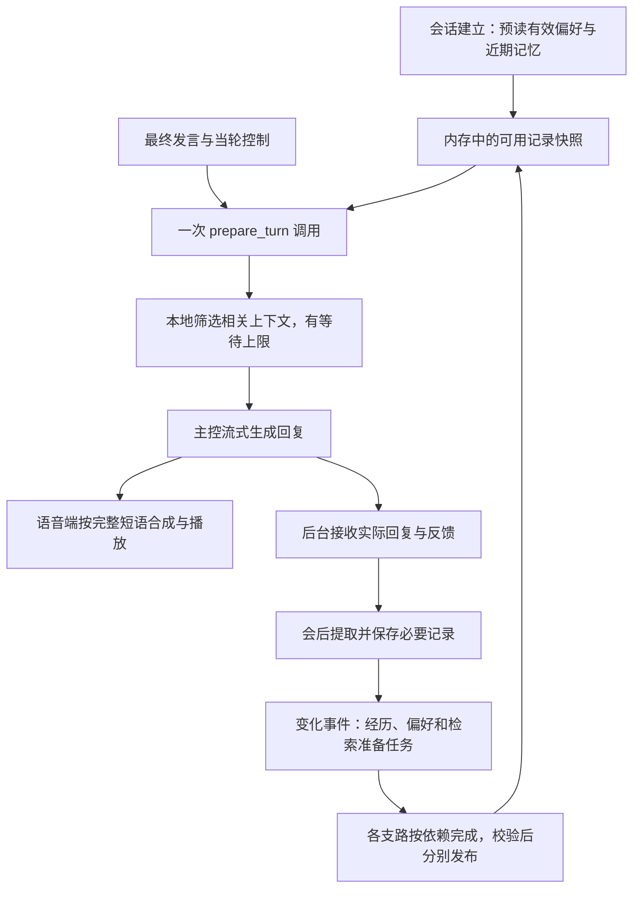

# GitHub 方案调研与低延迟设计

查阅日期：2026-09-26｜状态：设计参考，未安装、运行或对比测试这些项目。本文为 [设计稿](DESIGN.md)和 [API 契约](API.md)的 v0.2 补充。

后续 v0.3 的[语言适配设计](LANGUAGE-DESIGN.md)补充中文／英文桥接：输入、输出翻译分别计时；本地模型翻译也不是零开销，实时记忆查询不在线翻译，中文与英文演示的速度分别报告。

v0.4 按卢易锋补充，将后台扩展为按数据变化触发的并行任务，提前分析获准保存的历史。以下流程同步更新；未新增仓库性能结论，调度方案属于本项目设计。

结论：有相关 Skill 和开源框架可借鉴。最适合本项目的组合是**预先准备用户记忆、快速读取、后台总结、流式生成与播报**。Skill 指令负责规定调用方式，实际速度取决于运行链路，不能靠安装一个 Skill 就保证语音变快。

## 1. 找到了哪些项目

| 项目及一手资料 | 类型与本次看到的机制 | 对我们的用途 | 采用边界 |
|---|---|---|---|
| [LiveKit Agent Skills](https://github.com/livekit/agent-skills)；[Agents 运行框架](https://github.com/livekit/agents) | 官方开发指导 Skills 与语音框架。当前仓库列出 building、operating 等技能，覆盖精简上下文、预热和超时 | 借鉴语音设计与验收方法，由任务一评估流式链路 | Skill 是开发指导；不替换现有语音实现，不自动要求使用 LiveKit Cloud |
| [Memobase](https://github.com/memodb-io/memobase) | 预先整理用户画像／事件，聊天进入缓冲，支持后台 flush | 与我们的交流偏好＋经历记录方向最接近：提前准备而非每轮重算 | 采用架构思路；暂不迁移整套数据库或引入其全部画像类别 |
| [LangMem 延迟处理指南](https://github.com/langchain-ai/langmem/blob/main/docs/docs/guides/delayed_processing.md) | `ReflectionExecutor.submit` 延后处理，合并连续活动导致的重复任务 | 总结任务由后台队列执行；避免每个短句都触发提取 | 示例为框架用法，不是我们的持久化、授权与可靠性实现 |
| [Jannhsu/agent-memory](https://github.com/Jannhsu/agent-memory) | 用分类 Skill 文件保存记忆，插件后台提取；近期摘要使用滑动窗口 | 参考读写职责分离及近期上下文控制 | README 可读，尝试获取插件代码失败，未审计实现；默认原始日志和文件式画像不直接套用 |
| [Hindsight Skill](https://github.com/vectorize-io/hindsight/blob/main/skills/hindsight-docs/SKILL.md)；[项目](https://github.com/vectorize-io/hindsight) | 已有 Skill，区分 retain、recall、reflect，包含多路检索与记忆推理 | 后续较复杂的历史查询可评估为替代后端 | retain／reflect 有模型工作，不应默认插在每次语音回复之前；无本地延迟复测 |
| [Mem0](https://github.com/mem0ai/mem0) | 通用记忆基础设施，提供提取和检索接口；README 区分托管与开源能力 | 作为后续记忆后端备选 | 托管 benchmark 不能替代开源部署或本项目语音测量；首版没有必须迁移的证据 |

这些是源码仓库、维护者文档和 README 的审阅结果，未锁定提交 SHA，也未安装任何第三方 Skill。后续复用代码时须锁定版本并核对许可证。GitHub 搜索仍能返回 LiveKit 旧版 `livekit-agents` Skill；当前仓库说明已经拆分为多个技能，因此不能直接照旧页面的安装命令操作。

### 两个容易误读的点

**Memobase 的数字不是统一的端到端速度。** 同一 README 中，画像／事件读取描述为少量 SQL、在线延迟低于 100 ms；更新记录另提到带搜索的 context 可能为 500—1000 ms，受 embedding API 影响。两者路径不同，且都是项目方陈述，不能推成“接入后老人 100 ms 就听到回复”。[原始说明](https://github.com/memodb-io/memobase)

**异步语法不等于不阻塞回复。** 如果先 `await` 分析完再返回回复，用户仍需等待。LangMem 的延迟指南展示的是提交任务后返回的方式；我们借鉴任务调度，不照搬示例中的时间参数。[延迟处理示例](https://github.com/langchain-ai/langmem/blob/main/docs/docs/guides/delayed_processing.md)

## 2. 老人实际在等什么

需要区分：

1. **系统判断是否说完的时间：**必须给老人思考和停顿的空间，不能只为指标把收轮阈值压低。
2. **回复前的准备：**身份／控制／健康分流、读取记忆、构造上下文。
3. **模型与声音生成：**等待有意义的首段回复，再等待合成、网络与设备播放。

测量至少记录 `last_user_audio_at`、`turn_confirmed_at`、`memory_start/end`、`llm_first_token_at`、`first_meaningful_audio_played_at`。报告“用户最后发声到第一段有意义声音”和“确认收轮到第一段有意义声音”两种分布；“嗯”“我在听”等垫音单独统计，不当作主要答复完成。

健康流程如有慢调用，仍会影响整体速度，需要主控和任务二一起测量；记忆超时的回退不能绕开健康流程。不同阶段的 p95 不能简单相加当成整体 p95。

## 3. 实时流程与后台任务（更新至 v0.4）

会话开始时预读的只是授权范围内少量数据，无新模型调用。Skill 的主要指令与固定工具由宿主在会话初始化时准备；常规轮次由程序调用已注册接口，不增加“先问另一个 LLM 应该用哪个 Skill”的路由请求。

### 回复前只做必要且可控的工作

- `prepare_turn` 将“接收最终轮次＋更新临时控制＋构建上下文”合成一次进程内调用或 HTTP 往返；保留原子操作供维护和调试使用。
- 只读取已有记忆及当前文本，不调用总结 LLM，不调用云端 embedding 或 reranker。
- 缓存基础记录按用户、权限版本、记忆版本与有效期管理；新回复的上下文仍结合当前轮次和主题重新组装。不同用户和用途不共用结果。
- 检索到截止时间即停止额外搜索；权限及当轮控制已确定时，可用仍有效的快照和短期状态继续，无可用记忆就明确返回未完成检索。不能使用已撤回缓存，也不能将未查完写成“没有相关记忆”。
- 当前停止、不记录等要求先执行。权限或状态无法可靠确认时返回错误，主控继续处理当前要求，不使用历史内容；不会为了速度放行未知权限。

### 后台提前分析并行执行，实时回复优先

- 会话关闭后提取最小必要记录，清理原文缓冲；后续分析使用获准保存的历史。新增、更正和到期等变化触发相应任务，可在下一次聊天之前或聊天期间运行，不要求主控轮询任务完成后才继续聊天。
- 故事整理与偏好分析在来源提交后可独立推进，关键词索引／快照准备可与模型工作重叠；可选语言变体按源版本生成。需要前序结果的步骤仍按依赖执行，每条支路完成后独立发布，下一轮读取新结果。
- 同用户／任务种类／来源版本合并任务，队列有容量、时限和有限重试。后台**模型请求**并发初值为 1，CPU／I/O 工作另行调度；提高模型并发须验证前台延迟，不将“并行”理解为无限启动大模型请求。
- 模型推理不占着数据库写事务；后台工作与 HTTP 事件循环隔离，避免同步数据库或 CPU 工作阻塞收发。
- 同一 DGX 的 GPU／内存仍可能竞争。已经开始的推理未必能抢占，不能把“后台”当作资源隔离；要比较后台关闭／开启时的实时延迟，必要时延后分析或部署方安排资源。
- 会后提取从关闭会话起计入排队、执行和重试预算，到期即清理原始缓冲；后续任务只持有来源引用并有自己的时限。普通来源版本变化只作相关重算，撤回与删除立即阻止旧结果写回。

### 与语音端一起优化

回复生成支持流式输出，TTS 能力允许时按完整短语启动合成，避免等整段话生成完。工具结果依赖、安全分流与内容完整性仍需先满足，不能先播出尚未确定的事实。

LiveKit 的轮次调优文档支持提前生成，并说明了改口时取消、重算和额外计算成本；它也明确提前生成不一定降低实测延迟。因此首版不默认启用抢先发话。若后续尝试，只能提前计算并在确认收轮后播出，老人续说时取消，且提前计算不能写入记忆或触发有副作用工具。[官方轮次调优说明](https://docs.livekit.io/agents/logic/turns/tuning/)

## 4. 拟定性能目标与验收

**以下是我们的工程目标，均未实测，不来自论文或仓库的性能承诺。**

| 指标 | 第一轮建议目标／规则 | 测量范围 |
|---|---|---|
| 记忆服务额外耗时 | 热会话 p95 ≤ 50 ms；检索等待预算默认 100 ms | `prepare_turn` 从服务接收至响应就绪，含校验与排队；网络另记 |
| 回复前新增分析调用 | 0 次 | 提取、情绪推断、偏好分析、embedding 与 reranker 均不在这一路径 |
| 主回复生成 | 普通轮次不增加额外 LLM 路由／总结调用 | 原本用于回复的生成请求仍需要，不能称整体零 API |
| 收轮后首段有意义的声音 | p95 ≤ 1.5 秒，作为团队协商初始目标 | 整体链路目标，需任务一、主控、模型与设备共同验证 |
| 过载与截止时间 | 到截止点尝试取消额外检索，返回明确降级；不得越权 | 100 ms 是预算而非操作系统硬实时保证，必须记录实际超时 |
| 体验保护 | 同时报告误打断、错误引用、停止响应、缓存失效 | 不能靠更早打断或敷衍垫音实现低延迟 |

首轮测试矩阵：冷启动／热会话，每用户 100／1,000／10,000 条模拟记录，1／4 个并发会话，后台分析开／关、后台模型并发 1／2，以及模型和存储超时。用相同对话与模型比较“无记忆”“v0.1 串行接入”“预读＋合并调用＋后台任务”，记录 p50、p95、错误率、降级率及提取／检索质量。后台另记录队列长度、排队／分析／发布耗时、结果新鲜度和取消原因，验证无变化不反复分析、支路变慢不挡住回复。首轮不引入向量服务；只有相关性不足且预算容许时再比较。

## 5. 当前选择

首版继续保留轻量本地服务，采用 Memobase 的预先整理思路、LangMem 的延后任务方式，并把 LiveKit 的语音低延迟原则提供给任务一参考。Hindsight、Mem0 保留为可替换后端候选；没有证据证明直接迁移它们会比我们的当前目标更快。

已将合并调用、等待预算、缓存失效与耗时字段写入 API 草案。**仍需审核后才实现、安装或接入任何方案。**
