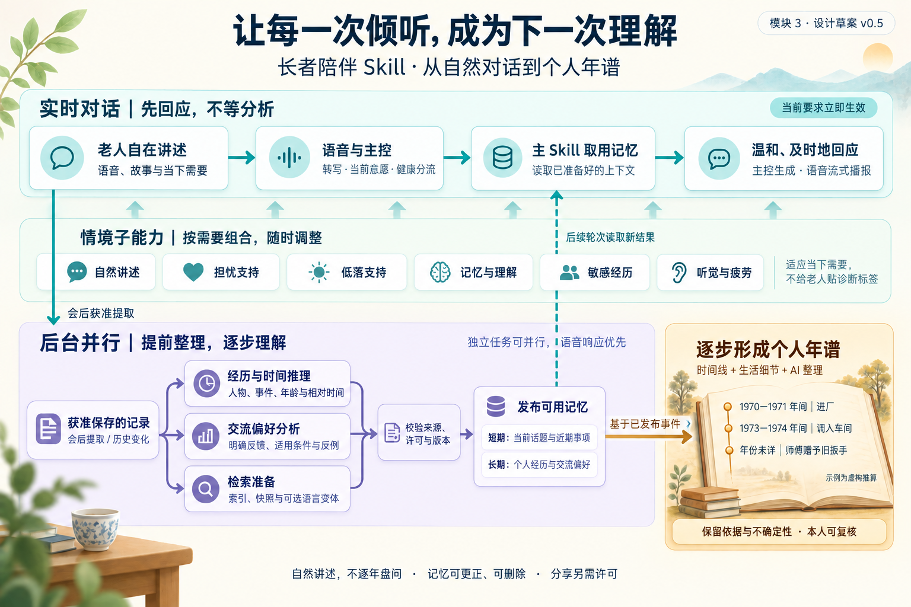

# 长者故事与记忆 Skill · 0.1.0 联调版

负责人：卢易锋。供主控、语音、健康探针与家属摘要模块接入。**本版先交付 Skill 与接口，不包含 Demo 页面。**

[](../../docs/module-3/assets/life-memoir-workflow-v0.5.png)

图示是完整架构目标；本版实现范围与限制见下文。[研究与设计依据](../../docs/module-3/README.md) · [Skill 入口](skills/life-memoir-retriever/SKILL.md) · [OpenAPI](schemas/openapi.json) · [联调检查脚本](examples/integration_smoke.py)。

## 队友从这里开始

Python 3.10+，建议 3.12。3.10 的超时兼容依赖会随安装自动加入；更新旧环境时请重新执行下面的安装命令，不能只复制源码或检查编译。以下命令在本目录执行：

```bash
python3 -m venv .venv
source .venv/bin/activate
python -m pip install -c constraints-tested.txt -e '.[dev]'
export MEMORY_API_TOKEN="$(python -c 'import secrets; print(secrets.token_urlsafe(32))')"
memory-skill serve --config examples/config.fixture.json --auth examples/auth.fixture.json
```

令牌在环境变量中，不写入仓库。另一终端使用同一个令牌环境变量，再执行：

```bash
source .venv/bin/activate
python examples/integration_smoke.py
```

该脚本只发送虚构 fixture-elder 的联调数据，检查授权→会话→检索→后台发布→年谱→下一次会话；默认固定规则提取，无模型/API 费用。重复运行会新增虚构故事，使用独立测试数据库。不要把它指向真实参与者数据服务。

`GET /healthz` 无须令牌；其余接口含 OpenAPI 都需要 Bearer 身份。服务仅绑定本机回环；单进程、单 worker、单数据库实例。跨机器联调可使用 SSH 隧道，生产部署的认证和持久队列需主控另行集成。

CLI 也可以发出单个请求：

```bash
memory-skill open_session --input examples/open-session.json
```

Skill 安装：把 [skills/life-memoir-retriever](skills/life-memoir-retriever) 整个文件夹复制到宿主的 Skill 搜索目录（如 Codex 的 `~/.codex/skills/`）。这是一次安装说明，本 PR 不修改队友的全局配置。其他宿主可把 SKILL.md 和按需参考规则加入主控提示，将 HTTP 操作注册为 tools。**复制 Skill 不会自动安装 Python 运行时或创建 MCP 工具。**

## 集成分工与时序

| 对接方 | 需要做什么 | 本模块返回什么 |
|---|---|---|
| 主控 | 维护稳定 user/session/turn ID、有效许可；唯一发话出口；处理工具失败 | 少量故事、近期事项、偏好、来源、版本与检索状态 |
| 语音模块 | 给最终转写与时区时间；按主控选择流式播报；上报实际回复方式 | 本模块不串行调用 ASR、翻译或 TTS |
| 健康模块 | 现有安全/健康分流优先执行；自身接口无需跟随本模块扩字段 | 交流支持规则，不输出诊断 |
| 家属摘要 | 用受限身份与 family_digest 读取，再执行自身摘要流程 | 仅逐条获准分享且其时间依据可见的视图 |

最小路径：

```text
主控：set_policy（已有有效许可时初始化，非每轮询问）
    → open_session
    → prepare_turn（最终用户发言 + query + 当前明确控制）
    → 主控一次流式生成，语音模块播报
    → observe_turn（可选：同 turn_id 的实际助手回复）
    → close_session（最近 session_version）
后台：提取最小记录 → 校验证据 → 发布
    → 检索缓存 / 偏好候选 / 时间约束与年谱重建
主控：下一轮读取已发布结果；维护端查询 job 状态
```

即时上下文不调用模型，不等后台完成；deadline_ms 是本地检索预算（10–100ms），不是端到端时延保证。宿主仍需设置网络/整轮截止时间。当前使用 SQLite 与关键词检索，没有向量库。后台模型并发默认 1，队列与任务时限有界；具体 DGX、中文模型、首音与打断性能尚未测量。

嵌入 Python 宿主：

```python
from life_memoir.config import Settings, Principal
from life_memoir.service import MemoryService

service = await MemoryService(Settings(storage_path=".data/memory.sqlite3")).start()
try:
    # principal 从主控身份系统产生，不能接受模型填入的任意角色。
    result = await service.execute("prepare_turn", request, principal)
    # 与前台共用 GPU 时可在繁忙期间暂停新的后台模型任务：
    service.set_foreground_busy(True)
    service.set_foreground_busy(False)
finally:
    # 正常退出、异常或取消时都清理后台任务。
    await service.close()
```

`close()` 先停止调度，再取消并等待已登记的后台任务，最后清理内存与关闭数据库；支持重复或并发调用。调用方在关闭中被取消时，会先完成共享清理再向该调用方抛出 `CancelledError`。已关闭实例不能再次 `start()`，需要创建新的 `MemoryService`。HTTP 生命周期也在 `finally` 中清理。自定义分析后端应及时响应取消，清理后继续抛出 `asyncio.CancelledError`。

独立 HTTP 进程尚无 foreground_busy 控制接口，应由部署层隔离资源或用嵌入方式；已发出的模型请求不会自动抢占。服务重启会丢失未提交会话原文，相关提取任务明确失败，不伪造成功。

## API v1

完整、可生成客户端的契约在 [schemas/openapi.json](schemas/openapi.json)，各操作共享 Python/CLI/HTTP 请求模型。JSON body 不重复路径 ID；CLI 输入使用完整请求 schema。

| 操作 | HTTP（前缀 /v1/memory） |
|---|---|
| set_policy | PUT /users/{user_id}/policy |
| open_session | POST /sessions |
| prepare_turn | POST /sessions/{session_id}/prepare-turn |
| observe_turn | POST /sessions/{session_id}/turns |
| build_context | POST /sessions/{session_id}/context |
| close_session | POST /sessions/{session_id}/close |
| get_job / list_jobs | GET /jobs/{job_id} · GET /users/{user_id}/jobs |
| list_entries / revise_entry | GET /users/{user_id}/entries · PATCH /entries/{entry_id} |
| forget_entries | POST /users/{user_id}/forget |
| get_chronicle | GET /users/{user_id}/chronicle |
| review_chronicle_event | PATCH /chronicle/events/{event_id} |

每次写入带 request_id。相同身份、操作、ID 和内容重试不重复执行；内容变化返回 IDEMPOTENCY_CONFLICT。读取可用 X-Request-ID。更新需 expected_version 或 expected_session_version；冲突后读当前记录重新决策，不盲重试。

统一返回 api_version / request_id / status / data / meta / error。status：ok、accepted（HTTP 202）、ignored（部分转写）、degraded、error。年谱 not_ready 是未发布/已失效；故障不能理解为“老人没有故事”。HTTP 401 身份无效，403 权限不足，404 不存在或越权对象，409 版本/幂等冲突，422 字段或能力限制，503 服务暂忙。CLI 返回码 0 正常/已受理，3 降级，1 业务失败，2 配置/传输错误。

meta 含 policy_version、memory_revision、replayed；实时结果另含 timings、cache_status、retrieval_complete、deadline_exceeded。list_entries 包含最小原话 evidence，供维护审阅。响应 data 当前为按操作约定的对象，OpenAPI envelope 尚未拆成 13 种强类型响应；调用样例与测试演示实际字段。

## 记忆、许可与删除

SQLite 保存故事、近期事项、交流观察、偏好、最小证据片段、任务状态和年谱视图；会话全文只在进程内短存。持久化默认全关，四种许可独立：long_term_memory、profile_learning、family_digest、remote_analysis。

- 临时会话默认闲置 30 分钟清理；最多 512 条发言、50 万字符；满后需关闭并新开会话。
- 近期事项默认 7 天，交流观察/推测偏好 30 天；明确长期偏好不过期。用途/时效/条件在每次读取时检查。
- 推测偏好为 pending，不直接作为本人要求；对话中不自动诊断或按病名分群。
- 任一轮 do_not_persist 会使整场会话跳过持久提取。这是首版保守范围；主控原文日志也应遵循本人选择。
- 撤回许可立即停止相应用途并阻止旧后台任务提交；已有存储需 forget_entries 明确删除。撤权不自动等于物理删除。
- 更正/删除会使相关缓存、候选、推算和年谱失效；持久回执只留哈希/ID，不缓存旧文本回包。
- family_digest 还需逐条 allowed_uses 授权；不分享出生锚点就不会向家属输出依赖它的推算年份。偏好/观察不进入家属输出。
- fixture 的 decision_refs 白名单仅供联调。真实参与者须将 decision_verifier 接到主控同意记录；引用只是主控核验后的凭证，不是模型自填的同意。

数据库权限设为 0600；无应用层加密或备份删除协调。本版适合本机集成，不声称具备完整生产治理。日志默认不输出发言、令牌或上游错误正文。

## 接真实模型与不同 API

复制 examples/config.model.json 为已忽略的 config.local.json，填实际 model 和服务地址；base_url 如 http://127.0.0.1:8000/v1，代码追加 /chat/completions。配置 backend=chat_completions，模型须支持中文、JSON 输出和 response_format=json_object。

本地 NVIDIA NIM/vLLM 等提供该协议时可接入；未对指定模型或 SDK 做实机认证。若使用外部域名，location 必须设 remote，并由本人许可 remote_analysis。key 仅填环境变量名称 api_key_env，实际值不写 JSON/PR。不经过实时双向翻译。

不同协议实现 [AnalysisBackend](src/life_memoir/backends.py)，提供 location 与 async analyze(operation, data) → AnalysisResult，然后注入 MemoryService(backend=...)。需支持 extract_candidates 与 reconcile_preferences，输出 [analysis_result.schema.json](schemas/analysis_result.schema.json)。模型无直接数据库写权限；候选必须有可核对的用户来源和原话，助手发言不能证明个人经历；主控应确认模型语义质量。

## 实现范围与下一棒

**已实现：**安装包、13 操作、共享输入校验、易失短期状态、SQLite 长期记录、异步后台、有来源年粒度推理、家属用途过滤、更正删除、六类按需 Skill 规则、JSON/Markdown 年谱。

**当前限制：**fixture 只识别有限示例；偏好推断依赖真实模型，fixture 只记明确表达；interaction_hints 暂为空，由主控应用 Skill 规则；story_reconcile 只是作业依赖节点，尚无事件合并；年谱文字是引用来源的模板，尚无文学传记生成；只有前后关系时不强算年份。复杂历法、翻译变体、向量召回、流式 ASR/TTS、自动健康分流、跨进程持久队列、Demo 页面和 DGX 性能验证均不包含。

队友可以立即做：将主控四个会话操作接入 → 在实际唯一回复生成中加载 Skill → 对接模型/同意账本 → 跑真实语音链路和目标设备延迟测量。不要把当前代码测试结果视为真实长者体验或临床效果证明。

## 验证与打包

```bash
python -m pytest -q
memory-skill schemas --out schemas
python -m build
```

测试涵盖跨会话/重启、原话引用、时间范围/冲突/循环、用户隔离、幂等、撤权时后台不落盘、不保存、更正/删除/TTL、家属隐藏锚点、慢分析不阻塞实时检索、HTTP 和模拟模型协议。退出回归还覆盖唤醒与取消竞争、异常生命周期、重复关闭，以及有分析中和等待并发槽的任务时 `asyncio.run()` 的完整子进程退出。无真实模型调用。constraints-tested.txt 记录本次验证版本；Skill 文件独立于 Python wheel，提交时一并交付 skills 目录。

退出压力测试可独立复跑：`python tests/shutdown_scenarios.py cancel_closer --repeat 100`；场景列表见该脚本的 `SCENARIOS`。CI 对 Python 3.10、3.11、3.12 运行完整测试，设置进程级超时，防止测试在事件循环收尾时无限挂起。实测结果与旧代码复现记录见 [VALIDATION.md](VALIDATION.md)。
